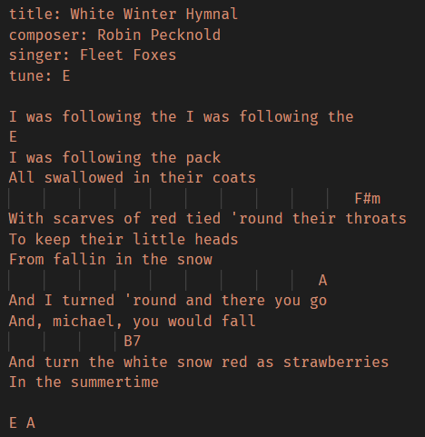
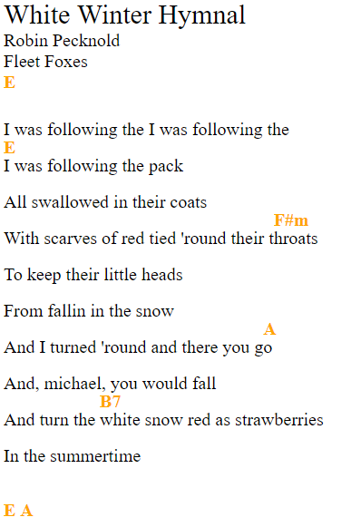

# Chords

Add some style for chords' songs.

## **Syntax**

### Tags

To add a tag, you just should write the name of it with a colon.
There are four tags:

* **title**  
Describes the song's name;
* **composer**  
Tells the composer's name;
* **singer**  
Tells who sings (it is useful if there are many versions of different singers);
* **tune**  
Tells the tune of the chords.

### Comments

To add a comment you should start a line with #.